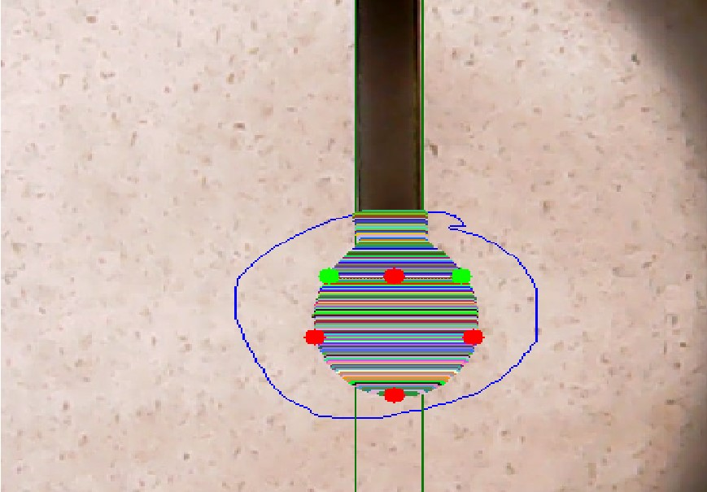
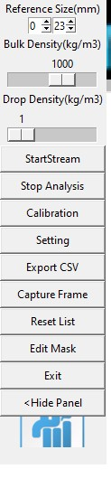
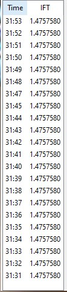

# Interfacial Tension Measurement Using IFT Cell and Crude Oil Injection

This Python application is designed to facilitate the measurement of Interfacial Tension (IFT) between fluid pairs. The application utilizes an IFT cell that is filled with the gas phase, and live crude oil is injected to create a pendant drop, allowing for accurate IFT measurements. The application provides a graphical user interface (GUI) for real-time analysis and visualization of IFT measurements.

## Features

- Real-time measurement of Interfacial Tension (IFT) between fluid pairs
- Utilization of an IFT cell to create a pendant drop for accurate measurements
- Configurable settings for IFT measurement and analysis
- Graphical representation of IFT measurements over time
- Exporting IFT measurement results to CSV files

## Screenshots

*Fig. 1:  Live crude oil injection to create a pendant drop.*

*Fig. 2: Main GUI interface for IFT measurement*

*Fig. 3: The live output of the results can be saved in a CSV file.*

*Fig. 4: Real-time Result of IFT measurements.*

## How It Works

1. The application prepares the IFT cell by filling it with the gas phase.
2. Live crude oil is injected into the IFT cell to create a pendant drop.
3. The pendant drop is analyzed to measure the Interfacial Tension (IFT) between the gas phase and the crude oil.
4. The application displays real-time IFT measurements and provides a graphical representation of the measurements over time.

## Getting Started

To get started with the application:

1. Install the required dependencies: Python, OpenCV, and Tkinter.
2. Clone this repository and navigate to the project directory.
3. Run the main.py script to launch the GUI application.
4. Configure the IFT measurement settings and other parameters.
5. Start the measurement process and observe real-time IFT measurements.
6. Export the IFT measurement results to CSV files for further analysis.

## Contact

For any inquiries or feedback, please feel free to reach out:

Name: Morteza Hatami  
Email: m.hatami@live.com
